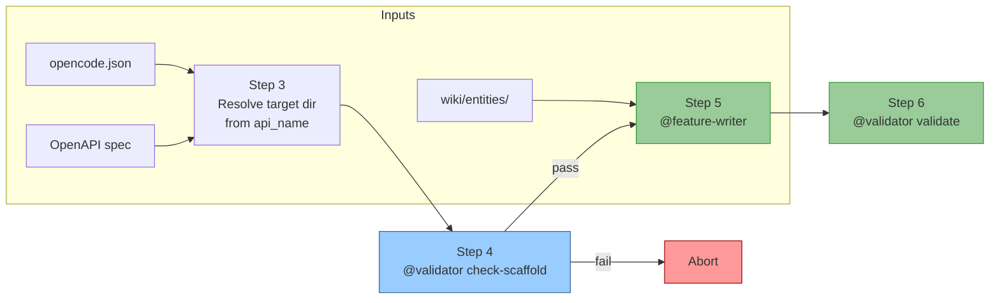

# Cucumber LLM Wiki

An LLM-maintained knowledge base for Cucumber JVM testing ecosystems. This project implements Karpathy's [LLM Wiki pattern](https://gist.github.com/karpathy/442a6bf555914893e9891c11519de94f) — the wiki is a persistent, compounding artifact that gets richer with every source you add and every question you ask.

## Architecture

Three conceptual layers, each with a distinct ownership boundary:

1. **Schema/Config layer** — `opencode.json` and `AGENTS.md` define project paths, conventions, and workflows. The LLM reads these to understand the rules but does not modify them. Owned by the user.

2. **Source layer** — `raw/` holds immutable source documents (articles, API specs, notes). The LLM reads only; never modifies. Owned by the user.

3. **Wiki layer** — `wiki/` is the LLM-generated knowledge base. The LLM creates, updates, and maintains every file here: entity pages, source summaries, reports, overview, and changelog. Owned entirely by the LLM.

See [Project structure](#project-structure) below for the full file tree.

## Quick start

1. Clone this repo.
2. Edit `opencode.json` with paths to your projects:

```json
{
  "cucumber-llm-wiki": {
    "frontend_spec": "frontend/openapi.yaml",
    "api_name": "info.title",
    "step_library": "../my-step-def-library",
    "feature_projects": ["../project-payments", "../project-orders"]
  }
}
```

3. Ingest existing projects into the wiki:

```
@wiki-ingestor ingest step-library
@wiki-ingestor ingest feature-projects
```

These create entity pages in `wiki/entities/` and source summaries in `wiki/sources/` that all other agents read for context.

## Generating tests

The pipeline orchestrates the full workflow end-to-end:

```
@pipeline run
```



Executes:
1. **Ingest step library** — scans `step_library` project, creates `wiki/entities/`
2. **Ingest feature projects** — scans `feature_projects`, creates `wiki/sources/`
3. **Resolve target directory** — reads `api_name` from config, navigates the spec, sanitizes + `_test`
4. **Validate scaffold** — `@validator check-scaffold` verifies project is wired to the step library
5. **Generate feature files** — `@feature-writer` produces `.feature` files + payloads
6. **Validate generated project** — `@validator validate` runs all 5 checks

Pipeline aborts at step 4 if the scaffold isn't ready.

### Manual step-by-step

Alternatively, run each step individually:

1. Place an OpenAPI spec at the `frontend_spec` path (default: `frontend/openapi.yaml`)
2. Ensure the scaffold project exists at `{target-dir}/` (resolved from `api_name` config key)
3. `@validator check-scaffold {target-dir}` — verify the scaffold is ready
4. `@feature-writer` — generates feature files and payloads using existing step definitions from the wiki
5. `@validator validate {target-dir}` — validate the generated output

## Maintenance

- `@wiki-linter` — periodically check wiki health for contradictions, orphans, stale pages, and coverage gaps
- Add new sources to `raw/` and use the standard ingest workflow
- Re-run `@wiki-ingestor` when step libraries or feature projects change

## Agent reference

Invoke agents in opencode using `@agent-name`.

### @pipeline

One-shot orchestrator that runs the entire workflow in sequence. Reads the latest instructions from each agent file so it always stays in sync.

```
@pipeline run
```

### @wiki-ingestor

Scans external Maven projects and documents them in the wiki.

**Ingest step definitions:**
```
@wiki-ingestor ingest step-library
```
Scans the `step_library` project for Java classes with `@Given`/`@When`/`@Then` annotations. Creates:
- `wiki/entities/{ClassName}.md` — one page per class listing its step patterns
- `wiki/queries/step-library-report.md` — summary table with step counts

**Ingest feature projects:**
```
@wiki-ingestor ingest feature-projects
```
For each project in `feature_projects`, scans:
- `public/openapi.yaml` — API spec
- `*.feature` files — scenarios, tags, backgrounds
- `requestPayload/`, `responsePayload/` directories — payload naming and reference conventions
- `mocks/` directories — mock framework and activation patterns
- Creates `wiki/sources/{project}.md` and `wiki/queries/{project}-report.md`

### @feature-writer

Generates `.feature` files and payload JSONs into a pre-existing scaffold Maven project.

```
@feature-writer
```

**Pre-requisite:** The scaffold project must already exist with `pom.xml`, `CucumberRunner.java`, and `junit-platform.properties` pre-configured. Run `@validator check-scaffold {target-dir}` to verify it's ready.

The output directory is determined by the `api_name` config key in `opencode.json` (default: `info.title` from the spec), sanitized with `_test` appended.

Before generating, reads the wiki to discover:
- Available `@Given`/`@When`/`@Then` step definitions from ingested libraries
- Payload conventions (directory structure, naming, reference patterns)
- Mock conventions (framework, directory, activation)

Generates files under `{target-dir}/`:
```
{target-dir}/
└── src/test/resources/
    ├── features/         # .feature files
    ├── requestPayload/   # Request body JSON files
    └── responsePayload/  # Expected response JSON files
```

### @validator

Two workflows:

**Check scaffold** — validates the project scaffold is ready for feature generation:
```
@validator check-scaffold pet-store-api_test
```
Checks:
1. Step library is ingested in `wiki/entities/` with a known package
2. Required scaffold files exist (`pom.xml`, `CucumberRunner.java`, `junit-platform.properties`)
3. `cucumber.glue` in properties matches the step library's package
4. `api_name` path resolves to a non-empty value in the OpenAPI spec

**Validate full project** — validates generated features against the wiki, schemas, and conventions:
```
@validator validate pet-store-api_test
```
Checks performed:
1. **Step def matching** — every Gherkin step matches a known `sg:` pattern from `wiki/entities/`
2. **Payload schema** — request/response payloads conform to the OpenAPI spec
3. **Convention compliance** — matches patterns from ingested feature projects
4. **Gherkin syntax** — valid Feature/Scenario/Given-When-Then structure
5. **Maven project** — standard layout, well-formed POM, package/directory match, dependency resolution, compilation (SKIP if Maven not installed)

Creates `wiki/queries/{target}-validation-report.md` with a detailed results table.

### @wiki-linter

Health-checks the wiki for contradictions, orphans, stale pages, and coverage gaps.

```
@wiki-linter
```

### @code-writer

General-purpose agent for writing and modifying code across the project.

## Testing

Run agent structure validation locally:

```powershell
./tests/agent-structure-test.ps1
```

Or via GitHub Actions on every push/PR (see `.github/workflows/test-agents.yml`).

### What the structure test checks

| Check | Description |
|-------|-------------|
| YAML frontmatter | Every agent file has valid `---` delimited frontmatter |
| Description | Every agent has a description field |
| Mode | Must be `subagent` |
| Temperature | Must be a numeric value |
| Permission block | Must declare `permission:` with tool keys |
| Permission consistency | Read-only agents (linter, validator) should not have `edit: allow` |
| Cross-references | Agents that reference other agents by name are documented |

### Manual integration testing

See `tests/integration-test-plan.md` for full end-to-end test procedures covering each agent.

## Project structure

```
.
├── AGENTS.md                    # Wiki schema and operations
├── opencode.json                # Agent configuration
├── README.md
├── .opencode/agents/
│   ├── code-writer.md           # General code writing
│   ├── feature-writer.md        # Cucumber feature generation
│   ├── wiki-ingestor.md         # Project ingestion
│   ├── wiki-linter.md           # Wiki health checks
│   ├── validator.md             # Generated project validation
│   └── pipeline.md              # Full workflow orchestration
├── frontend/
│   └── openapi.yaml             # Sample Pet Store API spec
├── raw/                         # Immutable source documents
└── wiki/
    ├── index.md
    ├── log.md
    ├── overview.md
    ├── entities/
    ├── concepts/
    ├── sources/
    └── queries/
```
